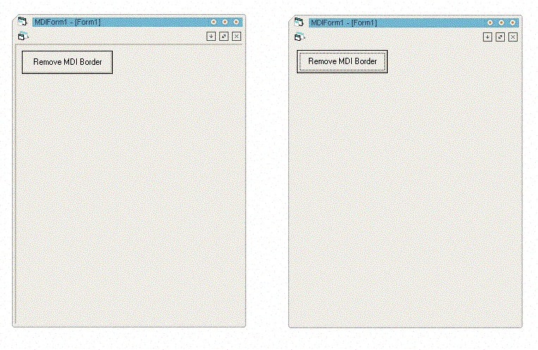



## MDI Client Borders

### Description

Spent alot of time trying to find code to do this easily, basically (see screenshot) this code removes the 3d border found on a MDI Form's 'MDIClient'. In turn you can make your MDI programs look like a single form! :P Easy to use, just pass the mdiForm to the main function in modBorders.bas . Please Vote!
 
### More Info
 

             |
---                |---
**Submitted On**   |2006-08-08 16:30:02
**By**             |[Aimee Bailey](https://github.com/Planet-Source-Code/PSCIndex/blob/master/ByAuthor/aimee-bailey.md)
**Level**          |Intermediate
**User Rating**    |4.3 (13 globes from 3 users)
**Compatibility**  |VB 6\.0
**Category**       |[Windows API Call/ Explanation](https://github.com/Planet-Source-Code/PSCIndex/blob/master/ByCategory/windows-api-call-explanation__1-39.md)
**World**          |[Visual Basic](https://github.com/Planet-Source-Code/PSCIndex/blob/master/ByWorld/visual-basic.md)
**Archive File**   |[MDI\_Client201206882006\.zip](https://github.com/Planet-Source-Code/aimee-bailey-mdi-client-borders__1-66222/archive/master.zip)

